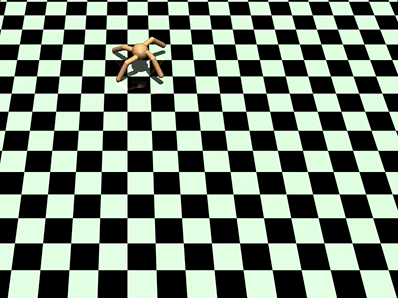

# Robotics with Python

In this repo you can find useful examples of 3D Simulations for Robotics.\
All the projects are documented on [*Medium*](https://maurodp.medium.com/) and [*TowardsDataScience*](https://towardsdatascience.com/author/maurodp/)
 
 
Here some of my fails:
 
 
	

					
	

	

					
	
